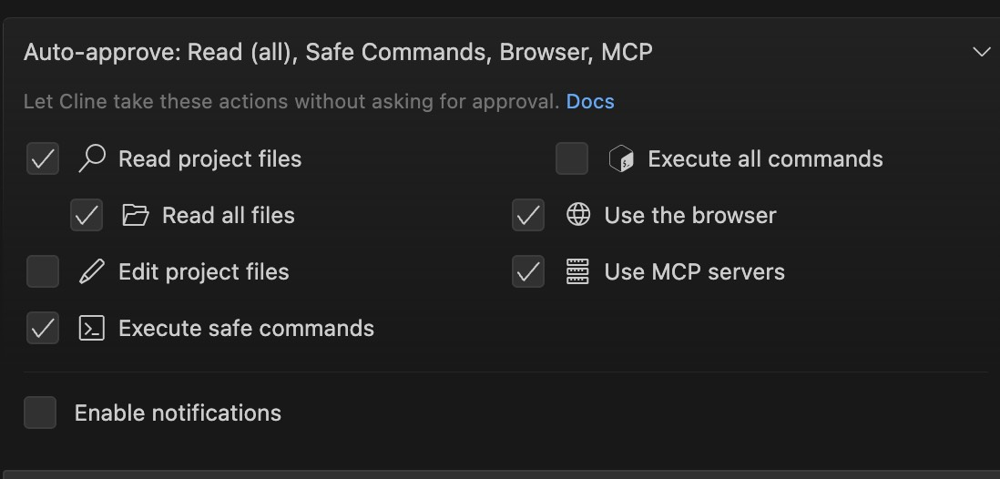
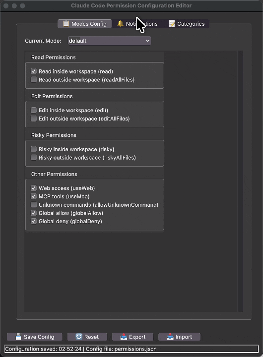
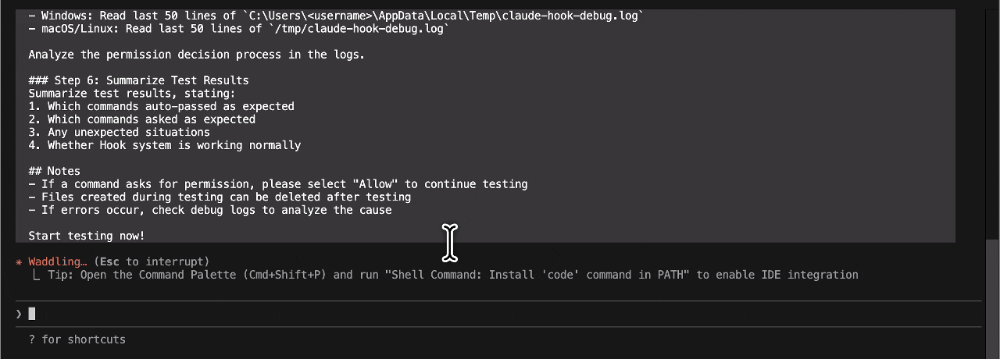
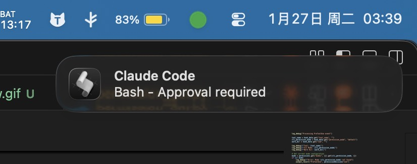
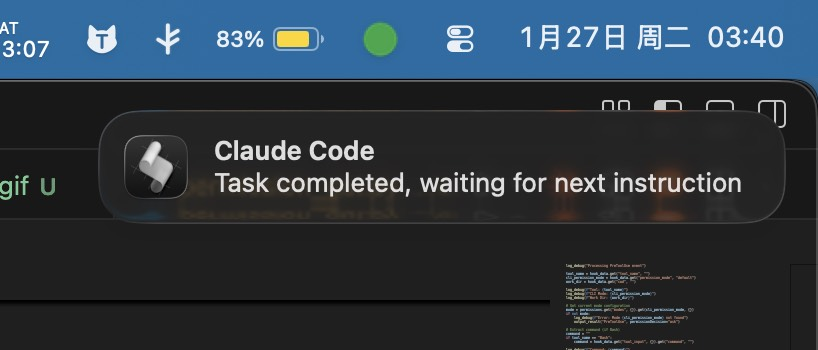
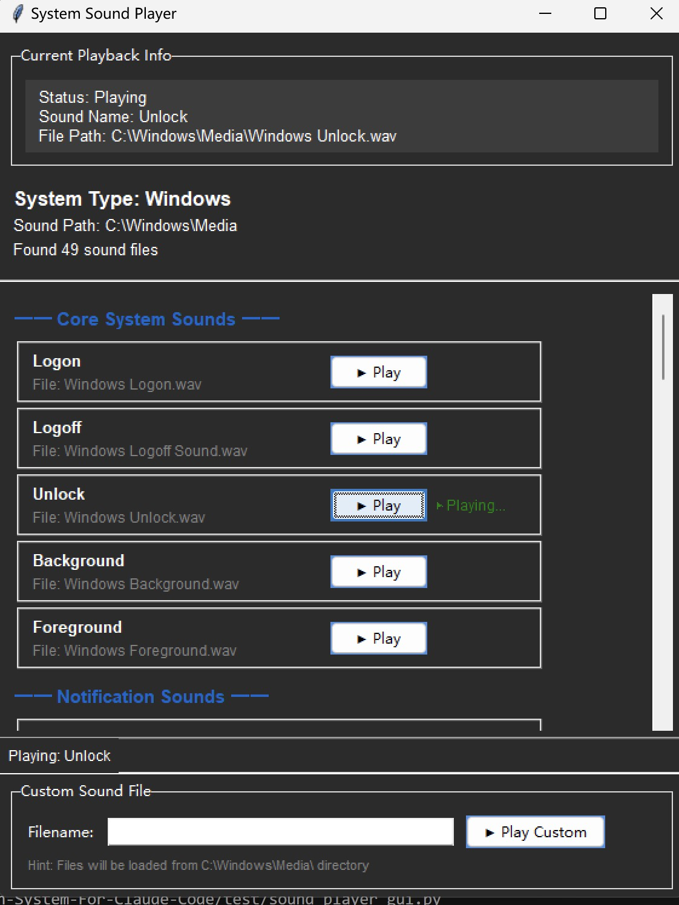
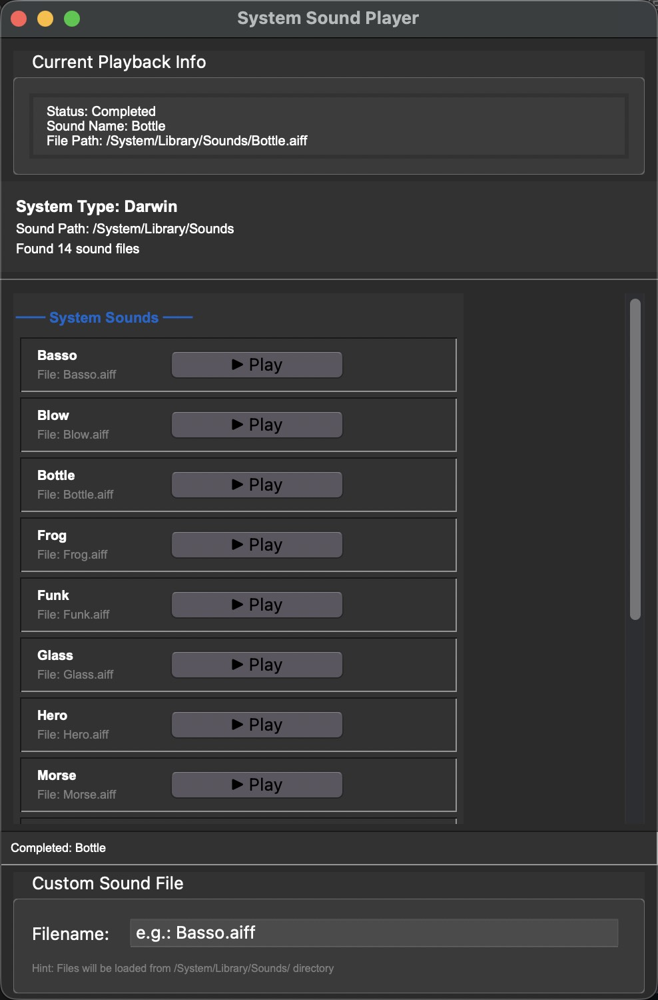

# Cline-Permission-System-For-Claude-Code

[](https://github.com/Tonyhzk/Cline-Permission-System-For-Claude-Code)
[](https://www.python.org/)
[](LICENSE)
[](https://claude.ai/code)


**Bring Cline's granular permission control to Claude Code.**

A flexible and powerful permission control system for Claude Code with unified configuration, Glob pattern support, and desktop notifications.

> Inspired by [Cline](https://github.com/cline/cline) and Claude, bringing enterprise-grade permission management to Claude Code.

**Cline Permission System**



## Author

**Tony HZK** ([@Tonyhzk](https://github.com/Tonyhzk))

- GitHub: [https://github.com/Tonyhzk](https://github.com/Tonyhzk)
- Project: [https://github.com/Tonyhzk/Cline-Permission-System-For-Claude-Code](https://github.com/Tonyhzk/Cline-Permission-System-For-Claude-Code)

## Core Features

- **GUI Configuration Editor**: User-friendly GUI interface, no need to manually edit JSON files
- **Unified Python Script**: Single script handles all Hook events, no need to maintain multiple platform scripts
- **Unified Configuration**: One JSON file manages all permissions
- **Simple to Use**: Just modify 0/1 switches
- **Glob Support**: Use `*` wildcards to match commands
- **Desktop Notifications**: Task completion and permission request alerts
- **Cross-Platform**: Full support for macOS, Linux, and Windows
- **UNC Path Support**: Perfect support for Windows UNC paths (network shares, Mac VMs, etc.)
- **No Restart Required**: Configuration changes take effect immediately
- **Workspace Protection**: Distinguish between operations inside and outside workspace
- **No Permission Issues**: Python scripts don't need chmod +x
- **Smart Path Handling**: Automatically identifies project paths, supports all path formats

---

## Quick Start

### File Structure

```
project-root/
├── .claude/
│   ├── permissions.json         # Unified configuration file
│   ├── settings.local.json      # Hook configuration
│   └── hooks/
│       └── unified-hook.py      # Unified Python Hook script (handles all events)
```

### Configure Permissions

#### Method 1: Using GUI Editor (Recommended)



Run the permission configuration GUI editor:

```bash
# Chinese version
cd src/zh_CN/.claude
python3 permission_gui.py

# English version
cd src/en_US/.claude
python3 permission_gui.py
```

The GUI editor provides:
- 📋 **Modes Config**: Visually switch and configure three CLI modes
- 🔔 **Notifications**: Configure task completion and permission request notifications
- 📝 **Categories**: Edit tools and commands lists using multi-line text boxes
- 💾 **One-Click Save**: Automatically validate and save configuration
- 📤📥 **Import/Export**: Easy configuration backup and migration

#### Method 2: Manual Configuration File Editing

Edit `.claude/permissions.json` and modify the switches for the corresponding mode:

```json
{
  "modes": {
    "default": {
      "read": 1,
      "readAllFiles": 0,
      "edit": 0,
      "editAllFiles": 0,
      "risky": 0,
      "riskyAllFiles": 0,
      "useWeb": 1,
      "useMcp": 1,
      "allowUnknownCommand": 0,
      "globalAllow": 1,
      "globalDeny": 1
    }
  }
}
```

Configuration takes effect immediately without restarting Claude Code.

---

## Permission Switches

| Switch | Value | Description |
|--------|-------|-------------|
| `read` | 1=allow, 0=ask | Read files inside workspace |
| `readAllFiles` | 1=allow, 0=ask | Read files outside workspace |
| `edit` | 1=allow, 0=ask | Edit files inside workspace |
| `editAllFiles` | 1=allow, 0=ask | Edit files outside workspace |
| `risky` | 1=allow, 0=ask | High-risk operations inside workspace |
| `riskyAllFiles` | 1=allow, 0=ask | High-risk operations outside workspace |
| `useWeb` | 1=allow, 0=ask | Network access (WebFetch, WebSearch) |
| `useMcp` | 1=allow, 0=ask | MCP server tools |
| `allowUnknownCommand` | 1=allow, 0=ask | Unclassified commands |
| `globalAllow` | 1=enable | Globally allowed system tools |
| `globalDeny` | 1=enable | Globally denied dangerous commands |

---

## Command Categories

### read (Read Operations)

**Tools**: `Read`, `Glob`, `Grep`

**Commands**:
```
cat, ls, head, tail, grep, find
git status, git log, git diff, git show, git branch, git remote
pwd, whoami, which, tree, wc, du, df
ps, top, env, printenv, test
file, stat, diff, sort, uniq, cut, awk, sed -n, jq
docker ps, docker images, docker logs
kubectl get, kubectl describe, kubectl logs
npm list, npm view, npm outdated, npm audit
pip list, pip show, poetry show
uname, hostname, uptime, date, cal
```

### edit (Edit Operations)

**Tools**: `Edit`, `Write`

**Commands**:
```
echo >, echo >>, cat >, cat >>
mkdir, touch, mv, cp
git add, git commit
npm install, pnpm install, yarn install, yarn add
pip install
```

### risky (High-Risk Operations)

**Commands**:
```
rm, rmdir, chmod, chown
git push, git pull, git reset, git rebase, git merge, git checkout
npm uninstall, pnpm uninstall, yarn remove, pip uninstall
sudo
```

### useWeb (Network Access)

**Tools**: `WebFetch`, `WebSearch`

**Commands**: `curl`, `wget`

### useMcp (MCP Servers)

**Tools**: `mcp__*` (all MCP tools)

### globalAllow (Globally Allowed)

**Tools**:
```
Task, TaskGet, TaskList, TaskOutput, TaskUpdate, TaskCreate
AskUserQuestion, EnterPlanMode, ExitPlanMode
```

### globalDeny (Globally Denied)

**Commands**:
```
git push --force*
rm -rf /*
rm -rf /etc*
rm -rf /usr*
rm -rf /var*
chmod -R 777 /*
```

---

## Usage Scenarios



### Daily Development (Recommended)

**CLI Mode**: `default` (Normal)

```json
{
  "read": 1,
  "readAllFiles": 1,
  "edit": 0,
  "allowUnknownCommand": 0
}
```

**Behavior**: Auto-approve read operations, confirm edits and risky operations

### Rapid Prototyping

**CLI Mode**: `acceptEdits`

```json
{
  "read": 1,
  "readAllFiles": 0,
  "edit": 1,
  "editAllFiles": 0,
  "allowUnknownCommand": 0
}
```

**Behavior**: Auto-approve reads and writes inside workspace, confirm operations outside workspace

### Plan Mode

**CLI Mode**: `plan`

```json
{
  "read": 1,
  "readAllFiles": 0,
  "edit": 0,
  "risky": 0
}
```

**Behavior**: Only allow reads, confirm all modification operations

---

## Switching Modes

### CLI Mode Switching

Press `Shift+Tab` in Claude Code:
- `plan` (Plan mode)
- `default` (Normal mode)
- `acceptEdits` (Auto-accept edits)

### Modify Permission Switches

Edit `.claude/permissions.json`, change switches to `1` (allow) or `0` (ask).

---

## Notification System

The system supports desktop notifications and sound alerts:





```json
{
  "notifications": {
    "enabled": 1,
    "onCompletion": {
      "enabled": 1,
      "title": "Claude Code",
      "message": "Task completed, waiting for next instruction",
      "sound": "Glass",
      "soundWindows": "Tada"
    },
    "onPermissionRequest": {
      "enabled": 1,
      "title": "Claude Code",
      "message": "Approval required",
      "sound": "Submarine",
      "soundWindows": "Notify"
    }
  }
}
```

### Sound Testing Tool

A cross-platform GUI tool is provided to test system sounds:

```bash
# Run the sound player GUI
python3 test/sound_player_gui.py
```

**Windows**



**Mac**



**Features**:
- 🎵 **Cross-Platform**: Supports macOS and Windows system sounds
- 🎯 **Individual Playback**: Play each sound separately with one click
- 📝 **Custom Input**: Enter custom sound file names to test
- 📊 **Categorized Display**: Sounds organized by category (Windows)
- ✅ **Real-time Status**: Shows playback status and file existence

**macOS Sounds**: Basso, Blow, Bottle, Frog, Funk, Glass, Hero, Morse, Ping, Pop, Purr, Sosumi, Submarine, Tink

**Windows Sounds**: System notifications, alerts, hardware events, classic sounds (Tada, Chimes, etc.), alarms, and ringtones

---

## Custom Commands

Add custom commands in `permissions.json` (supports Glob wildcards):

```json
{
  "categories": {
    "read": {
      "commands": ["your-command *", "another-cmd ?"]
    },
    "edit": {
      "commands": ["custom-build *"]
    }
  }
}
```

**Wildcard Explanation**:
- `*` matches any characters (including none)
- `?` matches a single character

---

## Cross-Platform Configuration

### Unified Python Script Architecture

The system uses a single Python script `unified-hook.py` to handle all Hook events, supporting:
- ✅ Cross-platform compatibility (macOS, Linux, Windows)
- ✅ Windows UNC paths (network shares, Mac VMs)
- ✅ Smart path identification (three-tier fallback mechanism)
- ✅ Chinese path support

### settings.local.json Configuration

Due to different OS requirements for Python commands and path formats, we provide two platform-specific configuration templates.

#### Initialize Configuration

**macOS/Linux users**:
```bash
cp .claude/doc/settings.local_mac.json .claude/settings.local.json
```

**Windows users**:
```cmd
copy .claude\doc\settings.local_win.json .claude\settings.local.json
```

**Important**: Restart Claude Code after copying the configuration file.

#### Platform Differences

| Item | macOS/Linux | Windows |
|------|-------------|---------|
| Environment Variable | `$CLAUDE_PROJECT_DIR` | `%CLAUDE_PROJECT_DIR%` |
| Path Separator | `/` | `\` |
| Execution Method | Direct script execution | `python` command |
| Special Support | - | UNC paths (`\\server\share`) |

#### Cross-Platform Switching

When switching between different operating systems, just copy the corresponding configuration file and restart Claude Code.

**Tip**: `.claude/settings.local.json` is added to `.gitignore` and won't be committed to version control.

---

## Debugging

### View Permission Decision Logs

**macOS/Linux**:
```bash
tail -f /tmp/claude-hook-debug.log
```

**Windows**:
```powershell
Get-Content $env:TEMP\claude-hook-debug.log -Tail 20 -Wait
```

### Log Content Example

```
=== 2026-01-26 13:44:55 ===
Received JSON: {"session_id":"...","cwd":"/Users/hzk/project"...
Hook Event: PreToolUse
Processing PreToolUse event
Tool: Bash
CLI Mode: default
Work Dir: /Users/hzk/project
Command: rm test.txt
  Matched pattern: rm *
Category: risky
In Workspace: True
Decision: risky + inside workspace + switch off = ask
Final Decision: ask
```

---

## Troubleshooting

### Python Script Not Executing
1. Check if Python is installed: `python3 --version` or `python --version`
2. Check if script path is correct: `.claude/hooks/unified-hook.py`
3. View log file to confirm if script is being called

### Windows UNC Path Issues

**Problem**: Hook execution fails with "UNC paths are not supported"

**Solution**: Use Windows-specific configuration file
```cmd
copy .claude\doc\settings.local_win.json .claude\settings.local.json
```
Then restart Claude Code.

### macOS Python Command Issues

**Problem**: "python: command not found"

**Solution**: Use macOS-specific configuration file
```bash
cp .claude/doc/settings.local_mac.json .claude/settings.local.json
```
Then restart Claude Code.

### Path Detection Errors
1. Check "Check path" and "Work directory" values in log file
2. Confirm path format is correct (UNC paths, Windows paths, etc.)
3. Check if path normalization is working properly

### Decision Not as Expected
1. View complete decision path in logs
2. Confirm current CLI mode (plan/default/acceptEdits)
3. Check if command is in globalAllow/globalDeny list
4. Confirm command classification is correct
5. Verify workspace judgment is accurate

### Notifications Not Showing
1. Check if `notifications.enabled` is 1 in `permissions.json`
2. Confirm corresponding event notification switch is enabled
3. macOS: Check system notification permissions
4. Linux: Confirm `notify-send` is installed
5. Windows: Check PowerShell execution policy

---

## Best Practices

1. **Default Conservative Configuration**: Only enable necessary permissions
2. **Elevate Permissions as Needed**: Switch to `acceptEdits` when required
3. **Regularly Review Logs**: Check for abnormal permission requests
4. **Unified Team Configuration**: Commit configuration files to version control
5. **Regularly Clean Logs**: Log files will continue to grow
6. **Use Unified Script**: Avoid maintaining multiple platform-specific scripts

---

## Development Guide

For development history, technical decisions, and implementation details of the permission system, please refer to [development-guide.md](docs/development-guide.md).

---

## License

MIT License - see [LICENSE](LICENSE) for details.

---

## Contributing

Contributions are welcome! Please feel free to submit issues and pull requests.

---

**Maintainer**: Cline-Permission-System-For-Claude-Code Contributors
**Last Updated**: 2026-01-26
