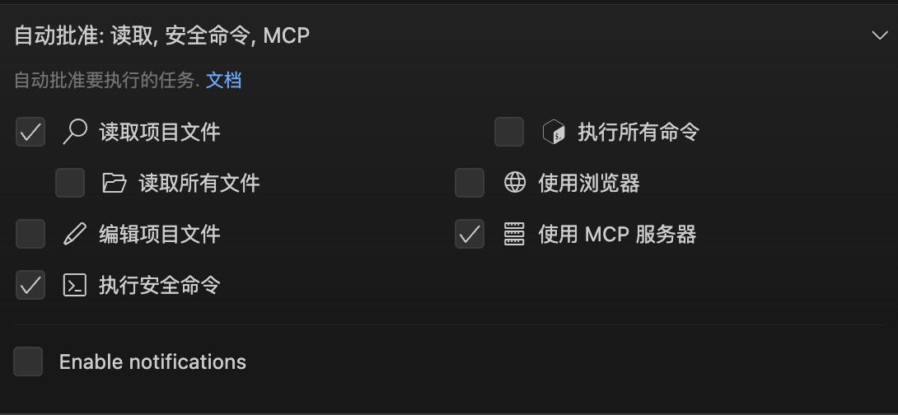
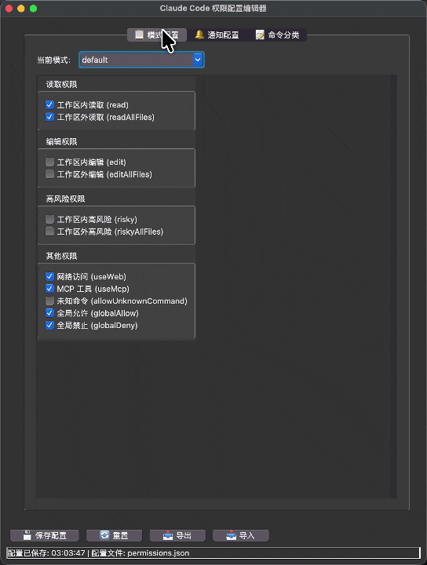
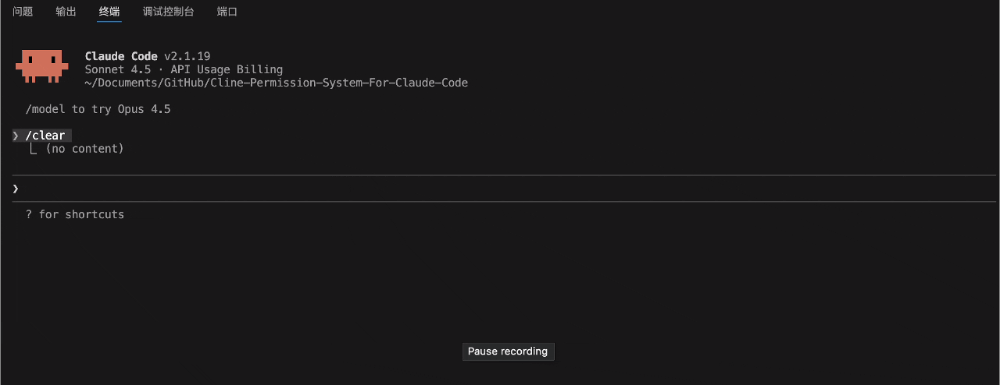
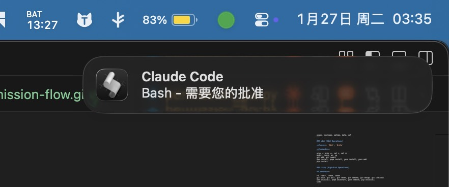
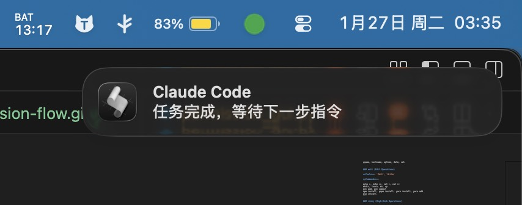
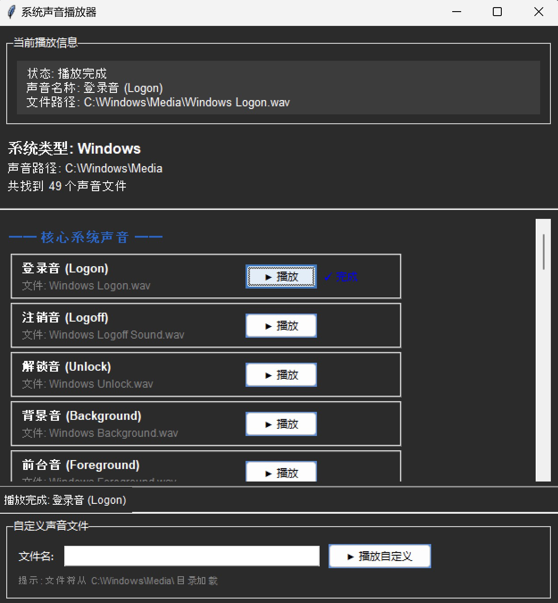
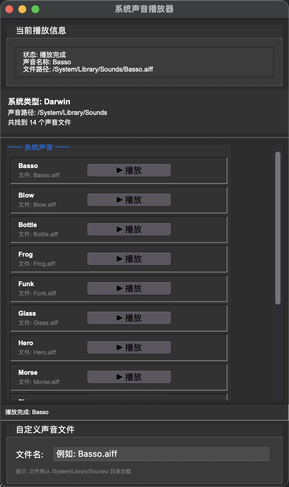

# Cline-Permission-System-For-Claude-Code

[](https://github.com/Tonyhzk/Cline-Permission-System-For-Claude-Code)
[](https://www.python.org/)
[](LICENSE)
[](https://claude.ai/code)


**将 Cline 的精细权限控制带到 Claude Code。**

一个灵活、强大的 Claude Code 权限控制系统，支持统一配置、Glob 通配符和桌面通知。

> 致敬 [Cline](https://github.com/cline/cline) 和 Claude，为 Claude Code 提供企业级权限管理能力。

**Cline Permission System**



## 作者

**Tony HZK** ([@Tonyhzk](https://github.com/Tonyhzk))

- GitHub: [https://github.com/Tonyhzk](https://github.com/Tonyhzk)
- 项目地址: [https://github.com/Tonyhzk/Cline-Permission-System-For-Claude-Code](https://github.com/Tonyhzk/Cline-Permission-System-For-Claude-Code)

## 核心特性

- **图形化配置编辑器**：提供友好的 GUI 界面，无需手动编辑 JSON 文件
- **统一 Python 脚本**：单一脚本处理所有 Hook 事件，无需维护多个平台脚本
- **统一配置**：一个 JSON 文件管理所有权限
- **简单易用**：只需修改 0/1 开关
- **Glob 支持**：使用 `*` 通配符匹配命令
- **桌面通知**：任务完成和权限请求提醒
- **跨平台**：macOS、Linux、Windows 完全支持
- **UNC 路径支持**：完美支持 Windows UNC 路径（网络共享、Mac 虚拟机等场景）
- **无需重启**：修改配置立即生效
- **工作区保护**：区分工作区内外操作
- **无权限问题**：Python 脚本无需 chmod +x
- **智能路径处理**：自动识别项目路径，支持所有路径格式

---

## 快速开始

### 文件结构

```
项目根目录/
├── .claude/
│   ├── permissions.json         # 统一配置文件
│   ├── settings.local.json      # Hook 配置
│   └── hooks/
│       └── unified-hook.py      # 统一 Python Hook 脚本（处理所有事件）
```

### 配置权限

#### 方式一：使用图形化编辑器（推荐）



运行权限配置 GUI 编辑器：

```bash
# 中文版本
cd src/zh_CN/.claude
python3 permission_gui.py

# 英文版本
cd src/en_US/.claude
python3 permission_gui.py
```

GUI 编辑器提供：
- 📋 **模式配置**：可视化切换和配置三种 CLI 模式
- 🔔 **通知配置**：配置任务完成和权限请求通知
- 📝 **命令分类**：使用多行文本框编辑工具和命令列表
- 💾 **一键保存**：自动验证并保存配置
- 📤📥 **导入导出**：方便配置备份和迁移

#### 方式二：手动编辑配置文件

编辑 `.claude/permissions.json`，修改对应模式的开关：

```json
{
  "modes": {
    "default": {
      "read": 1,
      "readAllFiles": 0,
      "edit": 0,
      "editAllFiles": 0,
      "risky": 0,
      "riskyAllFiles": 0,
      "useWeb": 1,
      "useMcp": 1,
      "allowUnknownCommand": 0,
      "globalAllow": 1,
      "globalDeny": 1
    }
  }
}
```

配置完成后立即生效，无需重启 Claude Code。

---

## 权限开关说明

| 开关 | 值 | 说明 |
|------|---|------|
| `read` | 1=允许, 0=询问 | 工作区内读取文件 |
| `readAllFiles` | 1=允许, 0=询问 | 工作区外读取文件 |
| `edit` | 1=允许, 0=询问 | 工作区内编辑文件 |
| `editAllFiles` | 1=允许, 0=询问 | 工作区外编辑文件 |
| `risky` | 1=允许, 0=询问 | 工作区内高风险操作 |
| `riskyAllFiles` | 1=允许, 0=询问 | 工作区外高风险操作 |
| `useWeb` | 1=允许, 0=询问 | 网络访问（WebFetch、WebSearch） |
| `useMcp` | 1=允许, 0=询问 | MCP 服务器工具 |
| `allowUnknownCommand` | 1=允许, 0=询问 | 未分类的命令 |
| `globalAllow` | 1=启用 | 全局允许的系统工具 |
| `globalDeny` | 1=启用 | 全局禁止的危险命令 |

---

## 命令分类

### read（读取类）

**工具**：`Read`, `Glob`, `Grep`

**命令**：
```
cat, ls, head, tail, grep, find
git status, git log, git diff, git show, git branch, git remote
pwd, whoami, which, tree, wc, du, df
ps, top, env, printenv, test
file, stat, diff, sort, uniq, cut, awk, sed -n, jq
docker ps, docker images, docker logs
kubectl get, kubectl describe, kubectl logs
npm list, npm view, npm outdated, npm audit
pip list, pip show, poetry show
uname, hostname, uptime, date, cal
```

### edit（编辑类）

**工具**：`Edit`, `Write`

**命令**：
```
echo >, echo >>, cat >, cat >>
mkdir, touch, mv, cp
git add, git commit
npm install, pnpm install, yarn install, yarn add
pip install
```

### risky（高风险类）

**命令**：
```
rm, rmdir, chmod, chown
git push, git pull, git reset, git rebase, git merge, git checkout
npm uninstall, pnpm uninstall, yarn remove, pip uninstall
sudo
```

### useWeb（网络访问）

**工具**：`WebFetch`, `WebSearch`

**命令**：`curl`, `wget`

### useMcp（MCP 服务器）

**工具**：`mcp__*`（所有 MCP 工具）

### globalAllow（全局允许）

**工具**：
```
Task, TaskGet, TaskList, TaskOutput, TaskUpdate, TaskCreate
AskUserQuestion, EnterPlanMode, ExitPlanMode
```

### globalDeny（全局禁止）

**命令**：
```
git push --force*
rm -rf /*
rm -rf /etc*
rm -rf /usr*
rm -rf /var*
chmod -R 777 /*
```

---

## 使用场景



### 日常开发（推荐）

**CLI 模式**：`default`（普通）

```json
{
  "read": 1,
  "readAllFiles": 1,
  "edit": 0,
  "allowUnknownCommand": 0
}
```

**行为**：读取操作自动通过，编辑和高风险操作需确认

### 快速原型开发

**CLI 模式**：`acceptEdits`

```json
{
  "read": 1,
  "readAllFiles": 0,
  "edit": 1,
  "editAllFiles": 0,
  "allowUnknownCommand": 0
}
```

**行为**：工作区内读写自动通过，工作区外操作需确认

### 计划模式

**CLI 模式**：`plan`

```json
{
  "read": 1,
  "readAllFiles": 0,
  "edit": 0,
  "risky": 0
}
```

**行为**：只允许读取，所有修改操作都需确认

---

## 切换模式

### CLI 模式切换

在 Claude Code 中按 `Shift+Tab` 快捷键：
- `plan`（计划模式）
- `default`（普通模式）
- `acceptEdits`（自动接受编辑）

### 修改权限开关

编辑 `.claude/permissions.json`，将对应开关改为 `1`（允许）或 `0`（询问）。

---

## 通知系统

系统支持桌面通知和声音提示：





```json
{
  "notifications": {
    "enabled": 1,
    "onCompletion": {
      "enabled": 1,
      "title": "Claude Code",
      "message": "任务完成，等待下一步指令",
      "sound": "Glass",
      "soundWindows": "Tada"
    },
    "onPermissionRequest": {
      "enabled": 1,
      "title": "Claude Code",
      "message": "需要您的批准",
      "sound": "Submarine",
      "soundWindows": "Notify"
    }
  }
}
```

### 声音测试工具

提供了跨平台的 GUI 工具来测试系统声音：

```bash
# 运行声音播放器 GUI
python3 test/sound_player_gui.py
```

**Windows**



**Mac**



**功能特性**：
- 🎵 **跨平台支持**：支持 macOS 和 Windows 系统声音
- 🎯 **单独播放**：一键播放每个声音
- 📝 **自定义输入**：输入自定义声音文件名进行测试
- 📊 **分类显示**：按类别组织声音（Windows）
- ✅ **实时状态**：显示播放状态和文件是否存在

**macOS 声音**：Basso, Blow, Bottle, Frog, Funk, Glass, Hero, Morse, Ping, Pop, Purr, Sosumi, Submarine, Tink

**Windows 声音**：系统通知、警告、硬件事件、经典声音（Tada、Chimes 等）、闹钟和铃声

---

## 自定义命令

在 `permissions.json` 中添加自定义命令（支持 Glob 通配符）：

```json
{
  "categories": {
    "read": {
      "commands": ["your-command *", "another-cmd ?"]
    },
    "edit": {
      "commands": ["custom-build *"]
    }
  }
}
```

**通配符说明**：
- `*` 匹配任意字符（包括空）
- `?` 匹配单个字符

---

## 跨平台配置

### 统一 Python 脚本架构

系统使用单一的 Python 脚本 `unified-hook.py` 处理所有 Hook 事件，支持：
- ✅ 跨平台兼容（macOS、Linux、Windows）
- ✅ Windows UNC 路径（网络共享、Mac 虚拟机）
- ✅ 智能路径识别（三层回退机制）
- ✅ 中文路径支持

### settings.local.json 配置

由于不同操作系统对 Python 命令和路径格式的要求不同，我们提供了两个平台专用的配置文件模板。

#### 初始化配置

**macOS/Linux 用户**：
```bash
cp .claude/doc/settings.local_mac.json .claude/settings.local.json
```

**Windows 用户**：
```cmd
copy .claude\doc\settings.local_win.json .claude\settings.local.json
```

**重要**：复制配置文件后需要重启 Claude Code 才能生效。

#### 平台差异

| 项目 | macOS/Linux | Windows |
|------|-------------|---------|
| 环境变量 | `$CLAUDE_PROJECT_DIR` | `%CLAUDE_PROJECT_DIR%` |
| 路径分隔符 | `/` | `\` |
| 执行方式 | 直接执行脚本 | `python` 命令 |
| 特殊支持 | - | UNC 路径（`\\server\share`） |

#### 跨平台切换

在不同操作系统之间切换时，只需复制对应的配置文件并重启 Claude Code。

**提示**：`.claude/settings.local.json` 已添加到 `.gitignore`，不会被提交到版本控制。


---

## 调试

### 查看权限决策日志

**macOS/Linux**：
```bash
tail -f /tmp/claude-hook-debug.log
```

**Windows**：
```powershell
Get-Content $env:TEMP\claude-hook-debug.log -Tail 20 -Wait
```

### 日志内容示例

```
=== 2026-01-26 13:44:55 ===
接收到的 JSON: {"session_id":"...","cwd":"/Users/hzk/project"...
Hook Event: PreToolUse
处理 PreToolUse 事件
Tool: Bash
CLI Mode: default
Work Dir: /Users/hzk/project
Command: rm test.txt
  匹配到模式: rm *
Category: risky
In Workspace: True
决策: risky + 工作区内 + 开关关闭 = ask
最终决策: ask
```

---

## 故障排查

### Python 脚本未执行
1. 检查 Python 是否安装：`python3 --version` 或 `python --version`
2. 检查脚本路径是否正确：`.claude/hooks/unified-hook.py`
3. 查看日志文件确认脚本是否被调用

### Windows UNC 路径问题

**问题**：Hook 执行失败，提示 "UNC paths are not supported"

**解决方案**：使用 Windows 专用配置文件
```cmd
copy .claude\doc\settings.local_win.json .claude\settings.local.json
```
然后重启 Claude Code。

### macOS Python 命令问题

**问题**：提示 "python: command not found"

**解决方案**：使用 macOS 专用配置文件
```bash
cp .claude/doc/settings.local_mac.json .claude/settings.local.json
```
然后重启 Claude Code。

### 路径检测错误
1. 查看日志文件中的 "检查路径" 和 "工作目录" 值
2. 确认路径格式是否正确（UNC 路径、Windows 路径等）
3. 检查路径标准化是否正常

### 决策不符合预期
1. 查看日志中的完整决策路径
2. 确认当前 CLI 模式（plan/default/acceptEdits）
3. 检查命令是否在 globalAllow/globalDeny 列表中
4. 确认命令分类是否正确
5. 验证工作区判断是否准确

### 通知未显示
1. 检查 `permissions.json` 中 `notifications.enabled` 是否为 1
2. 确认对应事件的通知开关是否启用
3. macOS: 检查系统通知权限
4. Linux: 确认 `notify-send` 是否安装
5. Windows: 检查 PowerShell 执行策略

---

## 最佳实践

1. **默认保守配置**：只开启必要的权限
2. **按需提升权限**：需要时切换到 `acceptEdits`
3. **定期审查日志**：检查异常的权限请求
4. **团队统一配置**：将配置文件提交到版本控制
5. **定期清理日志**：日志文件会持续增长
6. **使用统一脚本**：避免维护多个平台特定脚本

---

---

## 开发指南

如需了解权限系统的开发历史、技术决策和实现细节，请参考 [Claude-Code权限系统开发指南.md](Claude-Code权限系统开发指南.md)。
